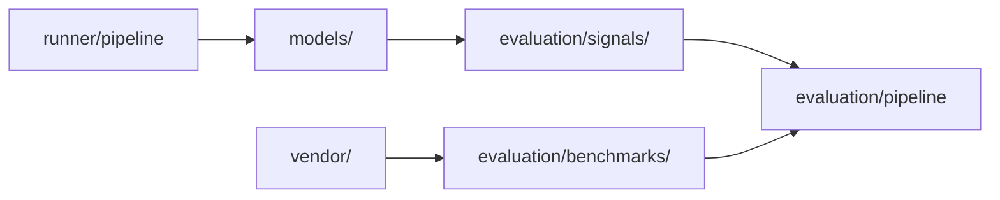

# UQLab

Core library for uncertainty quantification experiments: train models, run fast-pilot eval, score campaigns.

## Terms (short)

| Term | Where |
|------|--------|
| **Runner** | [`runner/pipeline.py`](runner/pipeline.py) — one experiment job |
| **Pipeline** | Runner stages (load → validate → execute) or [`evaluation/pipeline/`](evaluation/pipeline/) for campaigns |
| **Vendor port** | [`vendor/disentanglement_error/disentangling_model.py`](vendor/disentanglement_error/disentangling_model.py) — `fit` / `predict_disentangling` API |
| **FastPilotDisentanglingModel** | Adapter that runs `pipeline.run` and reads `results.pt` (not an in-process CNN) |

**Flow →** [`docs/UQLAB_FLOW.md`](../../docs/UQLAB_FLOW.md)

## Layout

```
uqlab/
├── models/           # Trainable PyTorch architectures + MC Dropout forwards
├── evaluation/       # Signals, metrics, pipeline, paper benchmarks
├── runner/           # Single-run engine (pipeline.run)
├── data/             # CIFAR-10N loaders, fast-pilot sampling
├── shared/           # Config schemas, utils, types
├── vendor/           # Vendored disentanglement_error metric
└── ui_components/    # Streamlit workflow (optional)
```



## Quick start — fast-pilot run

```python
from pathlib import Path
from uqlab.runner import pipeline

pipeline.run(
    config_path=Path("config.yaml"),
    run_dir=Path("results/run_0001"),
    seed=42,
)
```

Each run writes `summary.json`, `experiment.log`, and `results.pt` under the run’s `results/` folder. See [artifacts section](../../docs/UQLAB_FLOW.md#artifacts-results).

```python
from uqlab.models.factory import build_model
from uqlab.evaluation.signals.sources import run_sources
```

See [`models/README.md`](models/README.md) for `build_model()` and [`evaluation/signals/README.md`](evaluation/signals/README.md) for the signal registry.

## Quick start — disentanglement benchmark

Paper metric integration (label-noise + decreasing-dataset sweeps):

```python
from uqlab.evaluation.benchmarks.disentangling import (
    FastPilotDisentanglingModel,
    calculate_disentanglement_error,
    collect_cifar10_arrays,
)

X, y = collect_cifar10_arrays()
model = FastPilotDisentanglingModel.from_workflow_defaults()
score = calculate_disentanglement_error(X, y, model, return_json=False)
```

CLI: `scripts/runners/run_disentanglement_benchmark.py`

Full architecture and plot semantics → [`docs/features/disentanglement-benchmark.md`](../../docs/features/disentanglement-benchmark.md)

## Key modules

| Module | Role |
|--------|------|
| [`models/`](models/) | `build_model()`, CNN/ResNet/DINOv2+MLP, `mc_dropout` forwards |
| [`evaluation/signals/`](evaluation/signals/) | Primitives → registry → fast-pilot AUROC |
| [`evaluation/benchmarks/`](evaluation/benchmarks/) | `FastPilotDisentanglingModel` paper bridge |
| [`evaluation/pipeline/`](evaluation/pipeline/) | Campaign scoring, sweep plots, thesis diagrams |
| [`runner/pipeline.py`](runner/pipeline.py) | Training + eval orchestration for one experiment |
| [`vendor/disentanglement_error/`](vendor/disentanglement_error/) | Upstream metric loops (vendored) |

## Configuration

Experiment YAML is validated via `uqlab_orchestrator.run_spec` and [`shared/config/`](shared/config/). Workflow defaults live in the orchestrator package.

## Related docs

- Models → [`models/README.md`](models/README.md)
- Signals → [`evaluation/signals/README.md`](evaluation/signals/README.md)
- Evaluation → [`evaluation/README.md`](evaluation/README.md)
- Disentanglement benchmark → [`docs/features/disentanglement-benchmark.md`](../../docs/features/disentanglement-benchmark.md)
- **UQ flow** → [`docs/UQLAB_FLOW.md`](../../docs/UQLAB_FLOW.md)
- Vendor upstream → [`vendor/disentanglement_error/UPSTREAM.md`](vendor/disentanglement_error/UPSTREAM.md)
